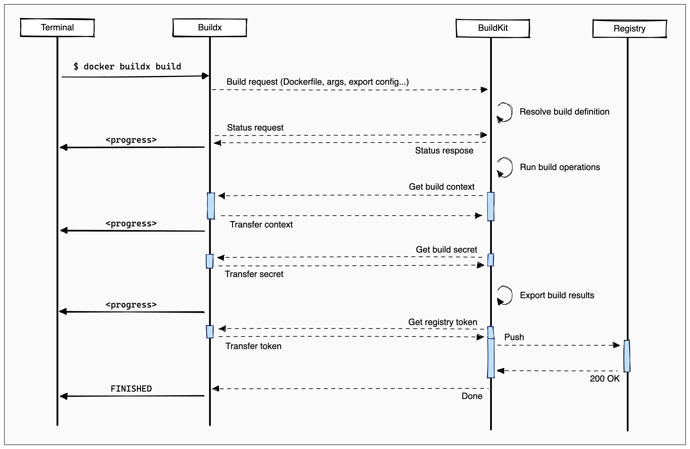

Docker Build implements a client-server architecture, where:

- Buildx is the client and the user interface for running and managing builds
- BuildKit is the server, or builder, that handles the build execution.

As of Docker Engine 23.0 and Docker Desktop 4.19, Buildx is the default build
client.

## Buildx

Buildx is a CLI tool that provides a user interface for working with builds.
Buildx is a drop-in replacement for the legacy build client used in earlier
versions of Docker Engine and Docker Desktop. In newer versions of Docker
Desktop and Docker Engine, you're using Buildx by default when you invoke the
`docker build` command. In earlier versions, to build using Buildx you would
use the `docker buildx build` command.

Buildx is more than just an updated `build` command. It also contains utilities
for creating and managing [builders](#builders).

### Install Buildx

Docker Buildx is installed by default with Docker Desktop. Docker Engine
version 23.0 and later requires that you install Buildx from a separate
package. Buildx is included in the Docker Engine installation instructions, see
[Install Docker Engine](../engine/install/index.md).

You can also build the CLI plugin from source, or grab a binary from the GitHub
repository and install it manually. See
[docker/buildx README](https://github.com/docker/buildx#manual-download)
for more information

## Builders

"Builder" is a term used to describe an instance of a BuildKit backend.

A builder may run on the same system as the Buildx client, or it may run
remotely, on a different system. You can run it as a single node, or as a cluster
of nodes. Builder nodes may be containers, virtual machines, or physical machines.

For more information, see [Builders](./builders/index.md).

## BuildKit

BuildKit, or `buildkitd`, is the daemon process that executes the build
workloads.

A build execution starts with the invocation of a `docker build` command.
Buildx interprets your build command and sends a build request to the BuildKit
backend. The build request includes:

- The Dockerfile
- Build arguments
- Export options
- Caching options

BuildKit resolves the build instruction and executes the build steps.
For the duration of the build, Buildx monitors the build status and prints
the progress to the terminal.

If the build requires resources from the client, such as local files or build
secrets, BuildKit requests the resources that it needs from Buildx.

This is one way in which BuildKit is more efficient compared to the legacy
builder it replaces. BuildKit only requests the resources that the build needs,
when they're needed. The legacy builder, in comparison, always takes a copy of
the local filesystem.

Examples of resources that BuildKit can request from Buildx include:

- Local filesystem build contexts
- Build secrets
- SSH sockets
- Registry authentication tokens

For more information about BuildKit, see [BuildKit](buildkit/index.md).

## Example build sequence

The following diagram shows an example build sequence involving Buildx and
BuildKit.

