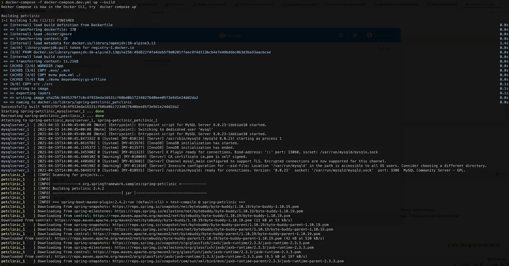
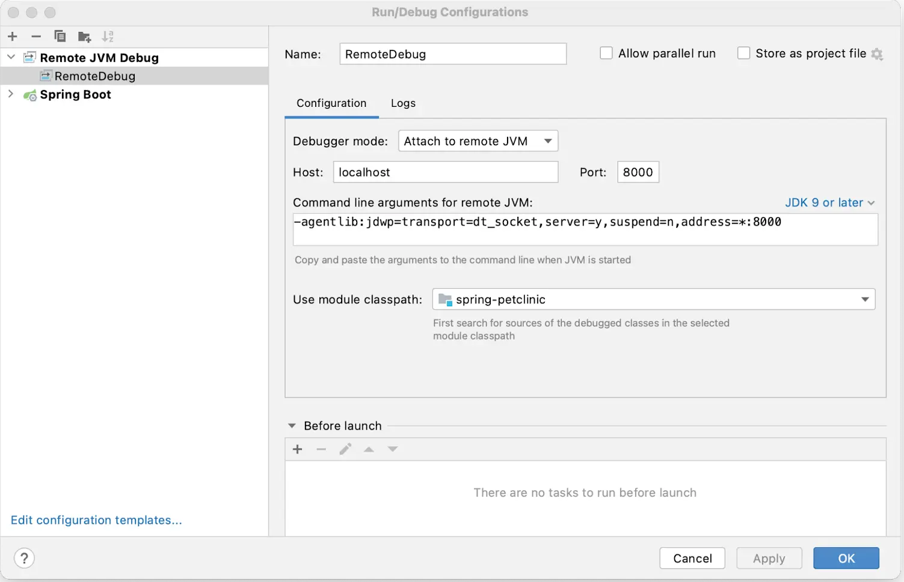
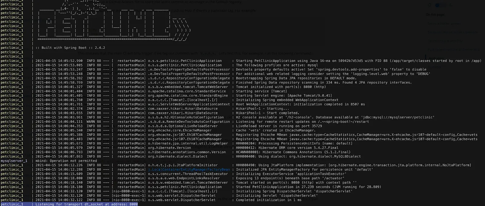
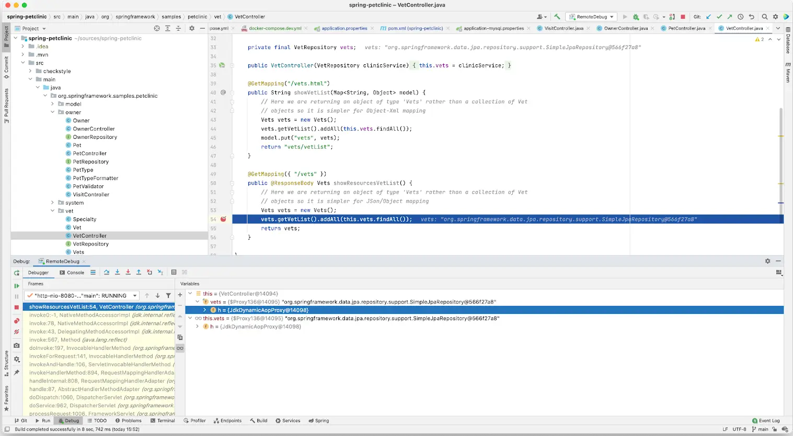

## Prerequisites

Work through the steps to build an image and run it as a containerized application in [Run your image as a container](run-containers.md).

## Introduction

In this module, you’ll walk through setting up a local development environment for the application you built in the previous modules. You’ll use Docker to build your images and Docker Compose to make everything a whole lot easier.

## Run a database in a container

First, you’ll take a look at running a database in a container and how you use volumes and networking to persist your data and allow your application to talk with the database. Then you’ll pull everything together into a Compose file which allows you to set up and run a local development environment with one command. Finally, you’ll take a look at connecting a debugger to your application running inside a container.

Instead of downloading MySQL, installing, configuring, and then running the MySQL database as a service, you can use the Docker Official Image for MySQL and run it in a container.

Before you run MySQL in a container, you'll create a couple of volumes that Docker can manage to store your persistent data and configuration. Use the managed volumes feature that Docker provides instead of using bind mounts. For more details, see [Using volumes](../../storage/volumes.md).

Create your volumes now. You’ll create one for the data and one for configuration of MySQL.

```console
$ docker volume create mysql_data
$ docker volume create mysql_config
```

Now you’ll create a network that your application and database will use to talk to each other. The network is called a user-defined bridge network and gives us a nice DNS lookup service which you can use when creating your connection string.

```console
$ docker network create mysqlnet
```

Now, run MySQL in a container and attach to the volumes and network you created. Docker pulls the image from Hub and runs it locally.

```console
$ docker run -it --rm -d -v mysql_data:/var/lib/mysql \
-v mysql_config:/etc/mysql/conf.d \
--network mysqlnet \
--name mysqlserver \
-e MYSQL_USER=petclinic -e MYSQL_PASSWORD=petclinic \
-e MYSQL_ROOT_PASSWORD=root -e MYSQL_DATABASE=petclinic \
-p 3306:3306 mysql:8.0
```

Now that you have a running MySQL, update your Dockerfile to activate the MySQL Spring profile defined in the application and switch from an in-memory H2 database to the MySQL server you just created.

You only need to add the MySQL profile as an argument to the `CMD` definition.

```dockerfile
CMD ["./mvnw", "spring-boot:run", "-Dspring-boot.run.profiles=mysql"]
```

Build your image.

```console
$ docker build --tag java-docker .
```

Now, run your container. This time, you need to set the `MYSQL_URL` environment variable so that your application knows what connection string to use to access the database. You’ll do this using the `docker run` command.

```console
$ docker run --rm -d \
--name springboot-server \
--network mysqlnet \
-e MYSQL_URL=jdbc:mysql://mysqlserver/petclinic \
-p 8080:8080 java-docker
```

Test that your application is connected to the database and is able to list Veterinarians.

```console
$ curl  --request GET \
  --url http://localhost:8080/vets \
  --header 'content-type: application/json'
```

You should receive the following json back from your service.

```json
{"vetList":[{"id":1,"firstName":"James","lastName":"Carter","specialties":[],"nrOfSpecialties":0,"new":false},{"id":2,"firstName":"Helen","lastName":"Leary","specialties":[{"id":1,"name":"radiology","new":false}],"nrOfSpecialties":1,"new":false},{"id":3,"firstName":"Linda","lastName":"Douglas","specialties":[{"id":3,"name":"dentistry","new":false},{"id":2,"name":"surgery","new":false}],"nrOfSpecialties":2,"new":false},{"id":4,"firstName":"Rafael","lastName":"Ortega","specialties":[{"id":2,"name":"surgery","new":false}],"nrOfSpecialties":1,"new":false},{"id":5,"firstName":"Henry","lastName":"Stevens","specialties":[{"id":1,"name":"radiology","new":false}],"nrOfSpecialties":1,"new":false},{"id":6,"firstName":"Sharon","lastName":"Jenkins","specialties":[],"nrOfSpecialties":0,"new":false}]}
```

## Multi-stage Dockerfile for development

Now you can update your Dockerfile to produce a final image which is ready for production as well as a dedicated step to produce a development image.

You’ll also set up the Dockerfile to start the application in debug mode in the development container so that you can connect a debugger to the running Java process.

The following is a multi-stage Dockerfile that you'll use to build your production image and your development image. Replace the contents of your Dockerfile with the following.

```dockerfile
# syntax=docker/dockerfile:1

FROM eclipse-temurin:17-jdk-jammy as base
WORKDIR /app
COPY .mvn/ .mvn
COPY mvnw pom.xml ./
RUN ./mvnw dependency:resolve
COPY src ./src

FROM base as development
CMD ["./mvnw", "spring-boot:run", "-Dspring-boot.run.profiles=mysql", "-Dspring-boot.run.jvmArguments='-agentlib:jdwp=transport=dt_socket,server=y,suspend=n,address=*:8000'"]

FROM base as build
RUN ./mvnw package

FROM eclipse-temurin:17-jre-jammy as production
EXPOSE 8080
COPY --from=build /app/target/spring-petclinic-*.jar /spring-petclinic.jar
CMD ["java", "-Djava.security.egd=file:/dev/./urandom", "-jar", "/spring-petclinic.jar"]
```

You first add a label to the `FROM eclipse-temurin:17-jdk-jammy` statement. This allows you to refer to this build stage in other build stages. Next, you added a new build stage labeled `development`.

You expose port 8000 and declare the debug configuration for the JVM so that you can attach a debugger.

## Use Compose to develop locally

You can now create a Compose file to start your development container and the MySQL database using a single command.

Open the `petclinic` in your IDE or a text editor and create a new file named `docker-compose.dev.yml`. Copy and paste the following commands into the file.

```yaml
version: '3.8'
services:
  petclinic:
    build:
      context: .
      target: development
    ports:
      - "8000:8000"
      - "8080:8080"
    environment:
      - SERVER_PORT=8080
      - MYSQL_URL=jdbc:mysql://mysqlserver/petclinic
    volumes:
      - ./:/app
    depends_on:
      - mysqlserver

  mysqlserver:
    image: mysql:8.0
    ports:
      - "3306:3306"
    environment:
      - MYSQL_ROOT_PASSWORD=
      - MYSQL_ALLOW_EMPTY_PASSWORD=true
      - MYSQL_USER=petclinic
      - MYSQL_PASSWORD=petclinic
      - MYSQL_DATABASE=petclinic
    volumes:
      - mysql_data:/var/lib/mysql
      - mysql_config:/etc/mysql/conf.d
volumes:
  mysql_data:
  mysql_config:
```

This Compose file is super convenient as you don't have to type all the parameters to pass to the `docker run` command. You can declaratively do that using a Compose file.

Another Compose feature is that you have service resolution set up to use the service names. Therefore, you are now able to use `mysqlserver` in your connection string. The reason you use `mysqlserver` is because that's what you've named your MySQL service as in the Compose file.

Now, to start your application and to confirm that it's running.

```console
$ docker compose -f docker-compose.dev.yml up --build
```

You pass the `--build` flag so Docker will compile your image and then starts the containers. You should see similar output if it runs successfully:



Now, test your API endpoint. Run the following curl command:

```console
$ curl  --request GET \
  --url http://localhost:8080/vets \
  --header 'content-type: application/json'
```

You should receive the following response:

```json
{"vetList":[{"id":1,"firstName":"James","lastName":"Carter","specialties":[],"nrOfSpecialties":0,"new":false},{"id":2,"firstName":"Helen","lastName":"Leary","specialties":[{"id":1,"name":"radiology","new":false}],"nrOfSpecialties":1,"new":false},{"id":3,"firstName":"Linda","lastName":"Douglas","specialties":[{"id":3,"name":"dentistry","new":false},{"id":2,"name":"surgery","new":false}],"nrOfSpecialties":2,"new":false},{"id":4,"firstName":"Rafael","lastName":"Ortega","specialties":[{"id":2,"name":"surgery","new":false}],"nrOfSpecialties":1,"new":false},{"id":5,"firstName":"Henry","lastName":"Stevens","specialties":[{"id":1,"name":"radiology","new":false}],"nrOfSpecialties":1,"new":false},{"id":6,"firstName":"Sharon","lastName":"Jenkins","specialties":[],"nrOfSpecialties":0,"new":false}]}
```

## Connect a Debugger

You’ll use the debugger that comes with the IntelliJ IDEA. You can use the community version of this IDE. Open your project in IntelliJ IDEA, go to the **Run** menu, and then **Edit Configuration**. Add a new Remote JVM Debug configuration similar to the following:



Set a breakpoint.

Open `src/main/java/org/springframework/samples/petclinic/vet/VetController.java` and add a breakpoint inside the `showResourcesVetList` function.

To start your debug session, select the **Run** menu and then **Debug _NameOfYourConfiguration_**.


You should now see the connection in the logs of your Compose application.



You can now call the server endpoint.

```console
$ curl --request GET --url http://localhost:8080/vets
```

You should have seen the code break on the marked line and now you are able to use the debugger just like you would normally. You can also inspect and watch variables, set conditional breakpoints, view stack traces and a do bunch of other stuff.



You can also activate the live reload option provided by SpringBoot Dev Tools. Check out the [SpringBoot documentation](https://docs.spring.io/spring-boot/docs/current/reference/html/using-spring-boot.html#using-boot-devtools-remote) for information on how to connect to a remote application.

## Next steps

In this module, you took a look at creating a general development image that you can use pretty much like your normal command line. You also set up your Compose file to expose the debugging port and configure Spring Boot to live reload your changes.

In the next module, you’ll take a look at how to run unit tests in Docker.


