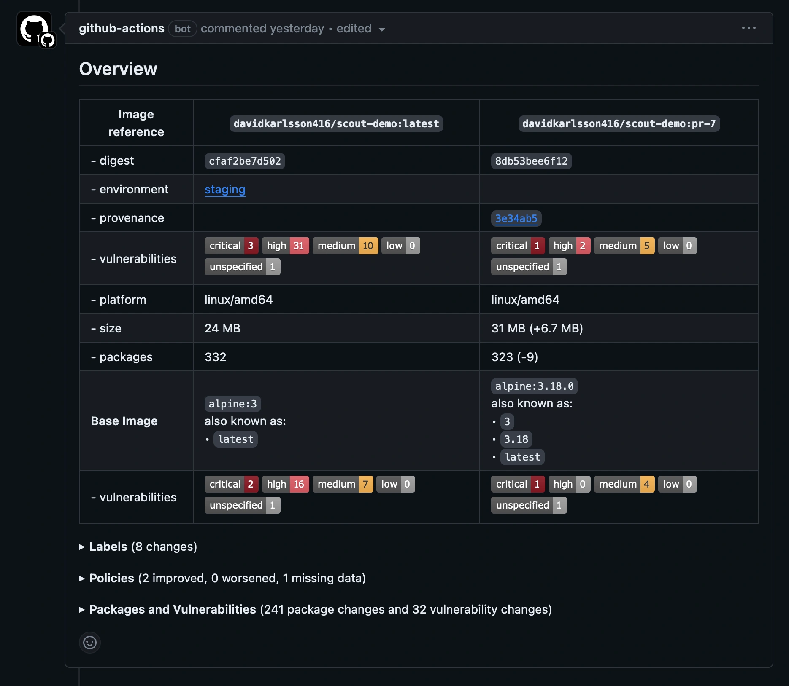
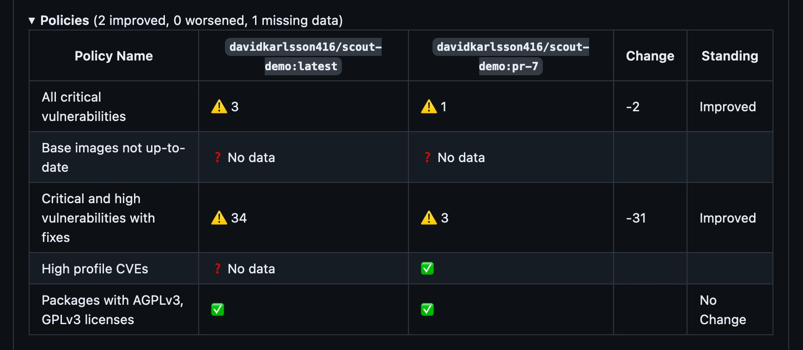

The following example shows how to set up a Docker Scout workflow with GitHub
Actions. Triggered by a pull request, the action builds the image and uses
Docker Scout to compare the new version to the version of that image running in
production.

This workflow uses the
[docker/scout-action](https://github.com/docker/scout-action) GitHub Action to
run the `docker scout compare` command to visualize how images for pull request
stack up against the image you run in production.

## Prerequisites

- This example assumes that you have an existing image repository, in Docker Hub
  or in another registry, where you've enabled Docker Scout.
- This example makes use of [environments](../environment/_index.md), to compare
  the image built in the pull request with a different version of the same image
  in an environment called `production`.

## Steps

First, set up the GitHub Action workflow to build an image. This isn't specific
to Docker Scout here, but you'll need to create build an image to have
something to compare with.

Add the following to a GitHub Actions YAML file:

```yaml
name: Docker

on:
  push:
    tags: ["*"]
    branches:
      - "main"
  pull_request:
    branches: ["**"]

env:
  # Hostname of your registry
  REGISTRY: docker.io
  # Image repository, without hostname and tag
  IMAGE_NAME: ${{ github.repository }}
  SHA: ${{ github.event.pull_request.head.sha || github.event.after }}

jobs:
  build:
    runs-on: ubuntu-latest
    permissions:
      pull-requests: write

steps:
  - name: Checkout repository
    uses: actions/checkout@v4
    with:
      ref: ${{ env.SHA }}

  - name: Setup Docker buildx
    uses: docker/setup-buildx-action@v3

  # Authenticate to the container registry
  - name: Authenticate to registry ${{ env.REGISTRY }}
    uses: docker/login-action@v3
    with:
      registry: ${{ env.REGISTRY }}
      username: ${{ secrets.REGISTRY_USER }}
      password: ${{ secrets.REGISTRY_TOKEN }}

  # Extract metadata (tags, labels) for Docker
  - name: Extract Docker metadata
    id: meta
    uses: docker/metadata-action@v5
    with:
      images: ${{ env.REGISTRY }}/${{ env.IMAGE_NAME }}
      labels: |
        org.opencontainers.image.revision=${{ env.SHA }}
      tags: |
        type=edge,branch=$repo.default_branch
        type=semver,pattern=v{{version}}
        type=sha,prefix=,suffix=,format=short

  # Build and push Docker image with Buildx
  # (don't push on PR, load instead)
  - name: Build and push Docker image
    id: build-and-push
    uses: docker/build-push-action@v5
    with:
      context: .
      sbom: ${{ github.event_name != 'pull_request' }}
      provenance: ${{ github.event_name != 'pull_request' }}
      push: ${{ github.event_name != 'pull_request' }}
      load: ${{ github.event_name == 'pull_request' }}
      tags: ${{ steps.meta.outputs.tags }}
      labels: ${{ steps.meta.outputs.labels }}
      cache-from: type=gha
      cache-to: type=gha,mode=max
```

This creates workflow steps to:

1. Check out the repository.
2. Set up Docker buildx.
3. Authenticate to the registry.
4. Extract metadata from Git reference and GitHub events.
5. Build and push the Docker image to the registry.

> **Note**
>
> This CI workflow runs a local analysis and evaluation of your image. To
> evaluate the image locally, you must ensure that the image is loaded the
> local image store of your runner.
>
> This comparison doesn't work if you push the image to a registry, or if you
> build an image that can't be loaded to the runner's local image store. For
> example, multi-platform images or images with SBOM or provenance attestation
> can't be loaded to the local image store.

With this setup out of the way, you can add the following steps to run the
image comparison:

```yaml
# You can skip this step if Docker Hub is your registry
# and you already authenticated before
- name: Authenticate to Docker
  uses: docker/login-action@v3
  with:
    username: ${{ secrets.DOCKER_USER }}
    password: ${{ secrets.DOCKER_PAT }}

# Compare the image built in the pull request with the one in production
- name: Docker Scout
  id: docker-scout
  if: ${{ github.event_name == 'pull_request' }}
  uses: docker/scout-action@v1
  with:
    command: compare
    image: ${{ steps.meta.outputs.tags }}
    to-env: production
    ignore-unchanged: true
    only-severities: critical,high
    token: ${{ secrets.DOCKER_PAT }}
```

The compare command analyzes the image and evaluates policy compliance, and
cross-references the results with the corresponding image in the `production`
environment. This example only includes critical and high-severity
vulnerabilities, and excludes vulnerabilities that exist in both images,
showing only what's changed.

The GitHub Action outputs the comparison results in a pull request comment by
default.



Expand the **Policies** section to view the difference in policy compliance
between the two images. Note that while the new image in this example isn't
fully compliant, the output shows that the standing for the new image has
improved compared to the baseline.


